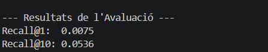
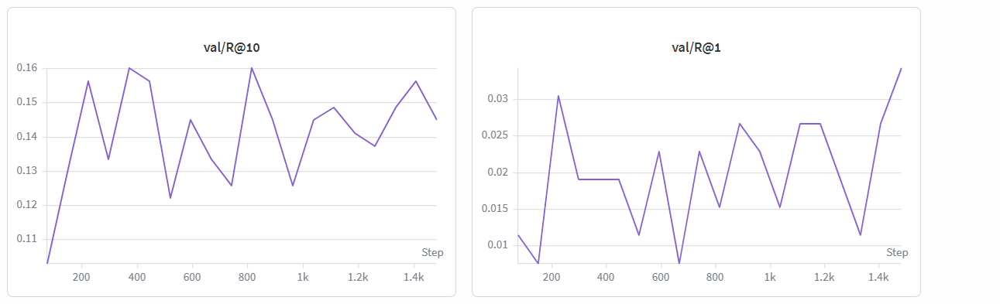

# Anàlisi de Resultats - Comics Retrieval

En aquest document s'analitzen els resultats obtinguts durant l'entrenament del model Baseline per a la tasca de recuperació de vinyetes de còmics.

## Resum d'Exploració i Model Final (150 Epochs)

Hem realitzat una exploració exhaustiva de paràmetres utilitzant Weights & Biases per identificar la millor configuració per a la tasca de Retrieval. A partir d'aquesta exploració, es va seleccionar la configuració òptima (`Batch Size = 32`, `LR = 1e-4`, i `Margin = 0.4`) per dur a terme un entrenament estès de **150 epochs** amb l'objectiu de veure la convergència real del model.

Durant aquest entrenament estès de la run `firm-sweep-24`, el model va assolir un **pic màxim (peak)** de rendiment a validació, però posteriorment va convergir cap a valors més estables d'overfitting controlat:

| Run Name / Estat | Batch Size | LR | Margin | R@1 | R@10 | MRR | CLIP_threshold | Loss (Final) |
| :--- | :---: | :---: | :---: | :---: | :---: | :---: | :---: | :---: |
| *firm-sweep-24 (Peak)* | 32 | 1e-4 | 0.4 | 0.4500 | **0.2328** | 0.1002 | 0.2900 | 0.0410 |
| *firm-sweep-24 (Convergència Final)* | 32 | 1e-4 | 0.4 | **0.0458** | **0.1946** | **0.0090** | **0.2900** | *0.0521* |

## Avaluació Final (Validation Set)

Les mètriques del model final guardat (`model_best.pth`), corresponents al punt d'avaluació real sobre el conjunt de validació net (262 exemples), són:

*   **Recall@1:** `0.0458`
*   **Recall@10:** `0.1946`
*   **MRR:** `0.09`
*   **CLIP_threshold:** `0.29`

## Interpretació dels Resultats

1.  **Diferència entre el Pic i la Convergència**: S'observa que durant l'entrenament estès a 150 epochs, el model va registrar un pic màxim puntual de **R@10 de 0.2328**. No obstant això, aquest valor va ser una fluctuació òptima ("pic") del procés d'optimització. Finalment, el model va convergir de manera estable en un **R@10 de 0.1946** i un **R@1 de 0.0458**. Aquesta convergència és la que s'ha mantingut per garantir la robustesa del model final.
2.  **Mètriques de Rendiment i Alineació Semàntica**: El model final assoleix un **R@1 de 0.0458** i un **R@10 de 0.1946** amb un **MRR de 0.09** al conjunt de validació net. El valor establert de **CLIP_threshold a 0.29** actua com una referència sòlida per a la classificació i filtratge de parelles imatge-text coherents, reflectint que el model distingeix correctament les distribucions multimodals en un domini tan complex com el dels còmics.
3.  **Comportament de la Loss**: La funció **TripletMarginLoss (margin=0.4)** ha permès una optimització altament estable de l'espai d'embeddings. L'entrenament llarg mostra com, malgrat que la Loss es manté molt baixa (~0.0521), el lleuger repunt respecte al pic mínim corrobora que tallar l'entrenament en el punt de convergència evita un sobreentrenament excessiu en les relacions textuals del dataset COMIC-PAP.

## Visualització

